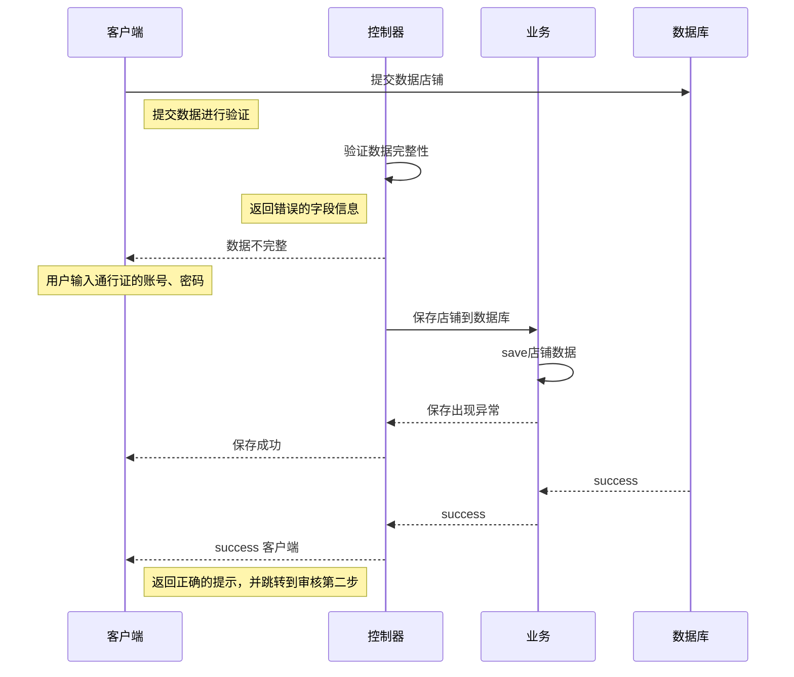

https://orangex4.cool/post/notes-in-markdown/

# 一级标题

## 二级标题

### 三级标题

每写完一个段落要隔一行空行.

就像这样, 隔了一行空行.

---

分割线

**重点加粗**

*斜体*

~~删除线~~

---

列表:

* 无序列表
  * 嵌套无序列表
  * 嵌套无序列表
* 无序列表
* 无序列表

1. 有序列表 1
   1. 嵌套有序列表 1
   2. 嵌套有序列表 2
2. 有序列表 2
3. 有序列表 3

---

引用文本:

> 引用别人说的话
> 就这样写
> By. OrangeX4

---

这是 `行内代码` 语法.

代码块语法:

```json
pm.test("Status code is 200", function () {
    pm.response.to.have.status(200);
});
```

:::  告警  
xxxx  
:::  

请将 ' 替换成 `.

---

[超链接名称：百度](https://www.baidu.com/)


---

表格:

| 表头 | 表头 |
| ---- | ---- |
| 内容 | 内容 |
| 内容 | 内容 |

---

注释:

<!-- 你看不见我 -->

**重点加粗**

*斜体*

~~删除线~~
==高亮==

- [x] 已经完成的事 1
- [ ] 未完成的事

### 甘特图


### 流程图
[超链接名称：用makedown(.md)做流程图](https://blog.csdn.net/weddell/article/details/122390672)